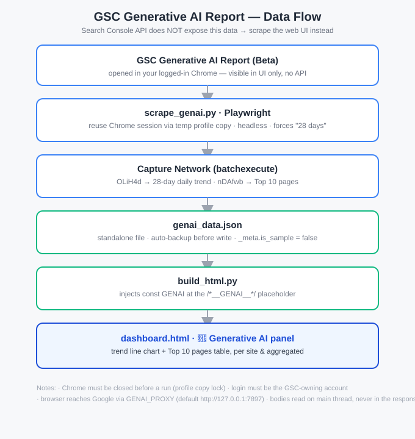

# GSC Generative AI 报告抓取模块

> 📖 English version: [README.en.md](README.en.md)

> 让任意 GSC Dashboard 展示 **Generative AI（AI Overviews / AI Mode）Impression 报告**——
> 因为 GSC 公开 API 目前**不开放**该维度，本项目用 Playwright 复用你已登录的 Chrome 会话，
> 批量抓取每个站点的 GenAI 报告页，解析网络请求拿到数据，写进 `genai_data.json`，再由前端渲染。

## 为什么是浏览器抓取（必读）

Google Search Console 的「Generative AI」报告（AI Overviews / AI Mode 展示量）**仅在网页后台(Beta)可见**，
`searchanalytics.query` 的 `searchAppearance` 维度没有 AI 相关取值。所以：

- ❌ **不能走 API 自动拉**（行业已确认 API 暂未开放）
- ❌ **手动逐个站点导出 CSV** 在站点多（几十个）时不现实
- ✅ **唯一可行路线**：用 Playwright 复用已登录 Chrome，循环抓全部站（本仓库做法）

## 功能

- 自动循环 `dashboard_data.json` 里的所有 `gsc_sites`
- 抓取每个站近 **28 天 AI Impression 趋势**（每日序列）
- 抓取每个站 **Top 10 AI Impression 页面**（URL + Impressions）
- 支持 `--site-url` 独立补抓任意站（不污染你的站点列表）
- 数据写入独立 `genai_data.json`（不依赖主数据管线，刷新不会被覆盖）
- 写入前自动备份

## 目录结构

```
genai-scraper/
├── scrape_genai.py            # 核心抓取脚本（Playwright）
├── run_genai.bat              # 一键全量抓取（Windows）
├── requirements.txt           # playwright==1.62.0
├── .gitignore                 # 已排除真实数据与敏感文件
├── example/
│   └── dashboard_data.example.json   # 最小站点列表示例
├── frontend/
│   ├── panel.html             # 面板 HTML 结构（粘进你的模板）
│   ├── renderGscGenAi.js      # 渲染函数
│   └── README.md              # 前端接入步骤
├── architecture.svg           # 架构 / 数据流图
├── README.md                  # 本文件（中文）
└── README.en.md               # 英文版
```

## 架构流程图



## 前置条件

| 项 | 要求 |
|---|---|
| 账号 | Chrome 已登录**持有这些 GSC 属性的 Google 账号** |
| 网络 | 浏览器能访问 Google（中国大陆需代理，默认 `http://127.0.0.1:7897`，可用 `GENAI_PROXY` 覆盖）|
| 环境 | Python 3.10+；Playwright（`pip install -r requirements.txt`）|
| Chrome | 已安装 **Google Chrome**（非 Chromium），用于绕过 App-Bound Encryption |

## 快速开始

```bash
# 1. 装依赖（推荐项目内 venv）
python -m venv .venv
.venv\Scripts\pip install -r requirements.txt      # Windows
# 或：pip install -r requirements.txt

# 2. 准备站点列表：把你的 GSC 站点放进 dashboard_data.json（参考 example/）
#    或完全不准备，直接用 --site-url 补抓（见下）

# 3. 关掉 Chrome（否则 profile 被锁，复制失败）

# 4. 跑（Windows 一键）
run_genai.bat
# 或
python scrape_genai.py
```

运行后生成 / 更新 `genai_data.json`。

## 命令行参数

| 参数 | 说明 |
|---|---|
| （无） | 抓取 `dashboard_data.json` 里的全部 `gsc_sites` |
| `--limit N` | 只抓前 N 个站 |
| `--site <名称或URL>` | 只重抓单个站 |
| `--profile <名>` | 指定 Chrome profile（默认 `Default`），若 GSC 会话在别的 profile |
| `--site-url <URL> [--site-url ...]` | 显式补抓站点（如 `https://example.com/` 或 `sc-domain:example.com`），不写 `dashboard_data.json` |
| `--only-extra` | 仅抓 `--site-url` 指定的站，跳过 `gsc_sites`（避免全量重抓）|
| `--dry-run` | 诊断模式：打印解析结果，不写文件 |

示例——只补抓两个站（不重抓全量）：

```bash
python scrape_genai.py --site-url https://example.com/ --site-url sc-domain:example2.com --only-extra
```

## 输出数据格式（`genai_data.json`）

```json
{
  "_meta": { "is_sample": false, "api_available": false, "updated_at": "2026-09-01",
             "source": "GSC Generative AI 报告(浏览器自动化抓取)" },
  "example.com": {
    "updated_at": "2026-09-01",
    "trend": [ { "date": "2026-08-05", "impressions": 12 }, ... ],
    "top_pages": [ { "page": "https://example.com/foo/", "impressions": 34 }, ... ]
  }
}
```

## 前端接入

让你的看板显示这份数据，见 **[frontend/README.md](frontend/README.md)** —— 三步：
注入 `const GENAI` → 粘入面板 HTML → 调用 `renderGscGenAi()`。

## 避坑指南（已逐一解决）

| 坑 | 现象 | 解决 |
|---|---|---|
| Chrome 127+ App-Bound Encryption | 复制的 cookie 解不开 / 跳登录 | 用** genuine Google Chrome 二进制** + 临时复制整个 profile 布局启动；跑前**关掉 Chrome** |
| 在 `response` 回调里读 `resp.body()` | 间歇 "Target page closed"、数据丢失 | 回调只收集 response 对象，**主线程 `drain()` 再读 body**（核心修复）|
| 不点时间范围 | 有的站只抓到 7 天 | 每次**强制点 "28 days"**，且**不清空 store** 等 `len>=27` |
| `sc-domain:foo.com` 前缀 | Top 页面全 0 | 用 `site_domain_of()` 剥前缀成 `foo.com` 再匹配页面 URL |
| 中途切了 Google 账号 | 补抓跳登录、`login_required` | 跑前确认 Chrome 登的是持有 GSC 的账号 |

## 安全 / 隐私

- `.gitignore` 已排除 `genai_data.json`、`dashboard_data.json`、`*.pre_genai_*`、`.venv/`、诊断文件——
  **不要把真实抓取数据或个人站点列表提交到公开仓库**。
- 脚本只读取你本地已登录的 Chrome profile 副本，不向任何第三方发送数据。

## License

MIT —— 见仓库根目录 [`LICENSE`](LICENSE) 文件（随意复用、修改、再发布）。
